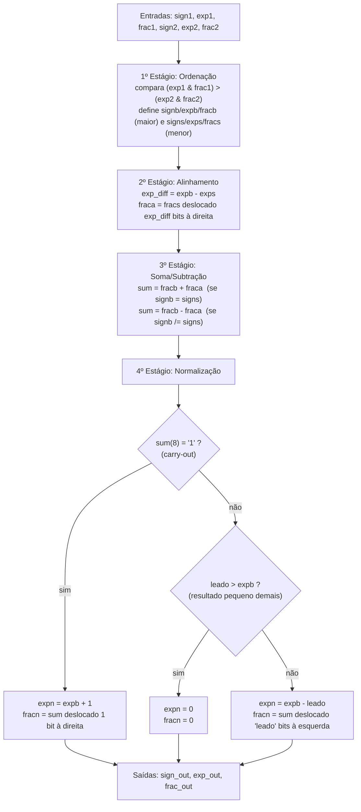
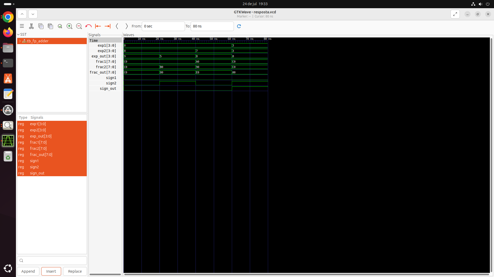
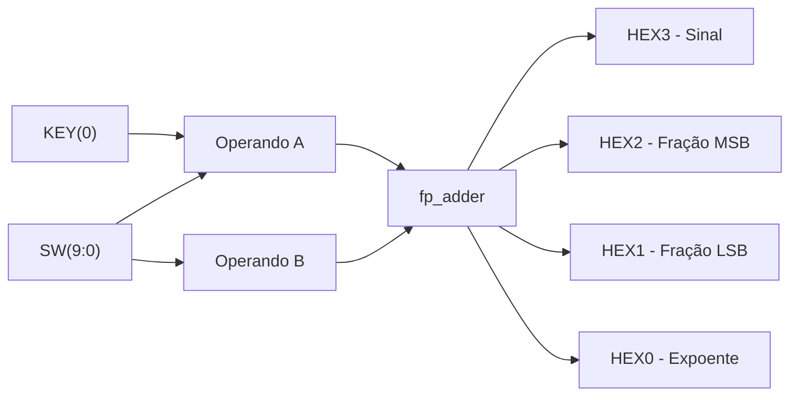
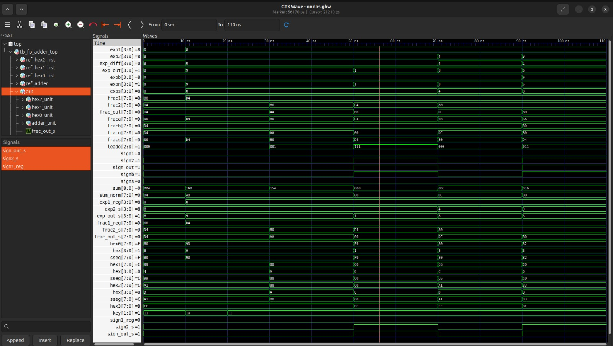

**template-somadorpf-vhdl**

# Tutorial: Implementação de Somador Ponto Flutuante na DE10-Lite

**Autores:** Bruna Montoro Teixeira, João Victor Chinarelli Cerqueira, Lívia de Pádua Ferné

**Disciplina:** Sistemas Digitais Q2.2026

**Data:** 07/08/2026

---
*Etapa 1*
## 1. Objetivo do Projeto
Este projeto adapta o somador de ponto flutuante simplificado (13 bits) do livro-texto para a placa Terasic DE10-Lite (MAX 10). O objetivo é demonstrar a síntese lógica e a simulação de hardware usando VHDL.

Nesta primeira etapa, o objetivo é validar o algoritmo matemático do circuito original antes de qualquer adaptação de hardware, sendo assim, compilar o código exatamente como descrito no livro, simular com o GHDL e conferir, no GTKWave, se o 4º estágio (normalização) executa corretamente a contagem de zeros à esquerda e o deslocamento do significando nos três cenários possíveis (sem deslocamento, com deslocamento à esquerda e com carry-out).

## 2. Descrição gráfica do funcionamento do sistema
O `fp_adder` representa números em ponto flutuante simplificado de 13 bits: 1 bit de sinal, 4 bits de expoente (sem sinal) e 8 bits de significando normalizado (`0.f`). O valor representado é:

```
valor = (-1)^sign × 0.frac × 2^exp
```

**Entradas e saídas do VHDL:**

| Sinal | Direção | Largura | Descrição |
|---|---|---|---|
| `sign1`, `sign2` | entrada | 1 bit | sinal dos operandos A e B |
| `exp1`, `exp2` | entrada | 4 bits | expoente dos operandos A e B |
| `frac1`, `frac2` | entrada | 8 bits | significando dos operandos A e B |
| `sign_out` | saída | 1 bit | sinal do resultado |
| `exp_out` | saída | 4 bits | expoente do resultado |
| `frac_out` | saída | 8 bits | significando do resultado |

O circuito é combinacional e processa a soma em 4 estágios sequenciais:



`leado` conta quantos zeros à esquerda existem no resultado da soma/subtração (funciona como um codificador de prioridade sobre os bits de `sum`), e é usado tanto para decidir se o resultado deve virar zero quanto para definir quantas posições o significando deve ser deslocado à esquerda na normalização.

**Evidências de Validação**
Para validar o circuito original, foram criados 4 casos de teste no `tb_fp_adder.vhd`, cobrindo os três comportamentos possíveis do 4º estágio (normalização):

| Teste | A | B | Resultado esperado | O que valida |
|---|---|---|---|---|
| 1 | 192 (0.75×2⁸) | 192 (0.75×2⁸) | 384 → `exp=9, frac=C0` | soma com *carry-out* (deslocamento à direita, expoente +1) |
| 2 | 192 (0.75×2⁸) | −176 (−0.6875×2⁸) | 16 → `exp=5, frac=80` | subtração com zeros à esquerda (deslocamento à esquerda) |
| 3 | 160 (0.625×2⁸) | 72 (0.5625×2⁷) | 232 → `exp=8, frac=E8` | soma sem necessidade de deslocamento (`leado="000"`) |
| 4 | 6 (0.75×2³) | −6 (−0.75×2³) | 0 → `exp=0, frac=00` | cancelamento total (resultado convertido para zero) |

Abaixo, a imagem do funcionamento do 4º estágio (normalização) no GTKWave, considerando os 4 casos detalhados:



**Observando o resultado:** os quatro casos bateram exatamente com o cálculo manual (`exp_out` = 9 → 5 → 8 → 0 e `frac_out` = C0 → 80 → E8 → 00, respectivamente).

**Observação técnica sobre o "zero negativo":** no Teste 4, embora o resultado numérico seja zero, o `sign_out` obtido foi `'1'` (negativo) em vez de `'0'`. Isso acontece porque, no 1º estágio, quando `exp1 & frac1 = exp2 & frac2` (empate exato de magnitude), o algoritmo original sempre roteia o operando B como "big" (`signb <= sign2`), e a saída `sign_out <= signb` herda esse sinal — mesmo quando o resultado final é zero. Trata-se de uma característica do algoritmo original do livro, não de um erro de implementação. (Complementar melhor!!!)

Conclusão: **sim, o circuito realiza corretamente tanto a contagem de zeros à esquerda quanto o deslocamento de normalização**, nos três cenários descritos no livro-texto (sem deslocamento, com deslocamento à esquerda por subtração, e com deslocamento à direita por carry-out), além do caso de cancelamento total.

---
*Etapa 2*
## 3. Adaptações de Hardware (DE10-Lite)
A estrutura lógica do módulo `fp_adder` foi mantida exatamente como fornecida. As adaptações foram realizadas na interface entre o somador e a placa FPGA utilizada no laboratório.

No projeto original, o módulo `fp_adder_test` era utilizado como interface entre o somador em ponto flutuante -  `fp_adder` - e a de desenvolvimento utilizada pelos autores originais do código. Como neste trabalho foi utilizada uma placa diferente, foi necessário implementar um novo módulo de topo (top-level module), denominado `fp_adder_top`, utilizado para adaptar a interface à placa disponível.

**Arquitetura original**
O módulo original `fp_adder_test` possuía as seguintes características:
* Utilização das entradas clk, sw e btn;
* Utilização do módulo `disp_mux`, que fazia a multiplexação dos displays;
* Utilização do módulo `hex_to_sseg`, que realizava a conversão dos valores hexadecimais em sinais para os displays;
* Operando A, parcialmente fixo e parcialmente definido pelas switches;
* Operando B, obtido pelas switches e botões.

Durante a adaptação inicial para a DE10-Lite, foi desenvolvido um primeiro protótipo que mantinha o operando A parcialmente fixo, como no projeto inicial. Entretanto, essa abordagem limitava a utilização do somador, pois somente o operando B podia ser escolhido livremente. Abaixo são detalhadas as mudanças realizadas para a adaptação das variáveis para a placa desejada e para permitir a escolha dos operandos de forma mais flexível.

**Removemos:** 
* O módulo `disp_mux` e o sinal `clk` que controlava a multiplexação dos displays - pois os displays do DE10-Lite são independentes (HEX0 a HEX3);
* O uso de botões para a entrada do expoente do segundo operando;
* O valor parcialmente fixo do operando A.

**Roteamos:**  
* As chaves switches da DE10-Lite para os campos dos operandos:
  - SW(9) -> bit de sinal;
  - SW(8 downto 5) -> expoente;
  - SW(4 downto 0) -> parte variável da fração.
* Displays da placa configurados de forma individual, a partir da saída do `fp_adder`:
  - HEX3 -> sinal do resultado;
  - HEX2 -> quatro bits mais significativos da fração (MSB);
  - HEX1 -> quatro bits menos significativos da fração (LSB);
  - HEX0 -> expoente.
* O botão KEY(0), que passou a armazenar o valor do operando A quando pressionado. Como os botões da DE!)-Lite são ativos em nível baixo, foi utilizada a detecção da borda de descida (`falling_edge`) para capturar os valores presentes nas switches.

**Reorganizamos:** 
* O novo módulo fp_ader_top, responsável por:
  - Fazer a interface entre as entradas físicas da DE10-Lite e o módulo fp_adder;
  - Capturar e armazenar o valor do operando A, definido pelas switches, quando KEY(0) é pressionado;
  - Definir o valor do operando B de forma contínua através das switches, após A já ter sido armazenado;
  - Converter o resultado do `fp_adder` para o formato dos displays, através do módulo `hex_to_sseg`.

Essas modificações permitiram adaptar o funcionamento do somador de ponto flutuante para a DE10-Lite, e permitir que ambos os operandos pudessem ser definidos pelo usuário.

**Descrição gráfica do sistema**
## Descrição gráfica do sistema
A figura abaixo, gerado utilizando Mermaid, apresenta a arquitetura final do sistema implementado na DE10-Lite. 

O operando A é obtido das chaves `SW(9:0)` quando o botão `KEY(0)` é pressionado, sendo armazenado internamente. Após essa etapa, as chaves passam a definir continuamente o operando B, até que o KEY(0) seja pressionado novamente. 

Ambos operandos A e B são enviados ao módulo `fp_adder`, que realiza a soma em ponto flutuante. O resultado é então convertido pelo módulo `hex_to_sseg` para ser mostrado nos displays HEX3 a HEX0, de sete segmentos conforme o mapeamento detalhado no tópico anterior. 



## 4. Evidências de Validação

### Simulação 

Abaixo, as formas de onda obtidas no GTKWave para os 4 casos de teste:




### Código VHDL Final 

O módulo `fp_adder` foi mantido conforme o fornecido, preservando a lógica de soma em ponto flutuante originalmente implementada. As modificações realizadas foram feitas no módulo `fp_adder_top`, desenvolvido a partir do `fp_adder_test` fornecido, para adaptar o projeto à placa DE10-Lite. Além disso, foi utilizado o módulo `hex_to_sseg`, que faz a conversão dos valores ehxadecimais para os sinais dos displays de sete segmentos.

**Principais adaptações realizadas**

#### **Destaque 1 - Armazenamento do operando A**
A principal alteração do projeto foi permitir a definição do operando A pelo usuário. Para isso, foram criados os registradores `sign1_reg`, `exp1_reg` e `frac1_reg`, responsáveis por armazenar o operando A. Eles são inicializados em zero e recebem os valores presentes nas switches quando `KEY(0)` é pressionado. 

```vhdl
signal sign1_reg: std_logic := '0';
signal exp1_reg: std_logic_vector(3 downto 0) := "0000";
signal frac1_reg: std_logic_vector(7 downto 0) := "00000000";
```

Para a lógica de armazenamento do valor, foi utilizado o botão `KEY(0)`, ativo na borda de descida:

```vhdl
process(KEY(0))
begin
    if falling_edge(KEY(0)) then
        sign1_reg <= SW(9);
        exp1_reg <= SW(8 downto 5);
        frac1_reg <= '1' & SW(4 downto 0) & "00";
	end if;
end process;
```

#### **Destaque 2 - Definição contínua do operando B**
Após pressionar o botão, os valores presentes nas switches são armazenados como operando A. Após essa captura, quaisquer alterações nas switches passam a definir o valor de B de forma contínua, até que o botão seja pressionado novamente para armazenar um novo valor a A.

```vhdl
sign2_s <= SW(9);
exp2_s <= SW(8 downto 5);
frac2_s <= '1' & SW(4 downto 0) & "00";
```

#### **Destaque 3 - Conexão com o fp_adder**
Uma das responsabilidades do módulo `fp_adder_top` é conectar os operandos ao núcleo do somador em ponto flutuante.

```vhdl
adder_unit: fp_adder
	port map (
		sign1 => sign1_reg,
        sign2 => sign2_s,
		exp1 => exp1_reg,
        exp2 => exp2_s,
		frac1 => frac1_reg,
        frac2 => frac2_s,
		sign_out => sign_out_s,
        exp_out => exp_out_s,
        frac_out => frac_out_s
	);
```

#### **Destaque 4 - Conversão da saída para os displays**
O resultado produzido pelo `fp_adder` é convertido pelo módulo `hex_to_sseg`, que transforma os dígitos hexadecimais em sinais correspondentes aos displays de sete segmentos. 

```vhdl
hex0_unit: hex_to_sseg
	port map (hex => exp_out_s, sseg => HEX0);

hex1_unit: hex_to_sseg
	port map (hex => frac_out_s(3 downto 0), sseg => HEX1);

hex2_unit: hex_to_sseg
	port map (hex => frac_out_s(7 downto 4), sseg => HEX2);

HEX3 <= "10111111" when sign_out_s = '1' else "11111111";
```


#### **Códigos completos**
Os códigos completos dos módulos utilizados no projeto são apresentados a seguir.

#### **fp_adder_top.vhd**
```vhdl
library ieee;
use ieee.std_logic_1164.all;

-- Top-level para a placa DE10-Lite.
-- É o correspondente ao fp_adder_test fornecido, ajustado para a placa


-- Mapeamento de entradas 
--
--	 Operando A:
--   Definido pelas switches antes de pressionar KEY(0)
--   sign1<= SW(9)
--   exp1 <= SW(8 downto 5)
--   frac1 <= '1' & SW(4 downto 0) & "00"
--
--	 Operando B:
--   Definido pelas switches após pressionar KEY(0), de forma contínua
--   sign2<= SW(9)
--   exp2 <= SW(8 downto 5)
--   frac2 <= '1' & SW(4 downto 0) & "00"


-- Mapeamento de saidas:
--   HEX0 <= exp_out           		(1 digito hexadecimal)
--   HEX1 <= frac_out(3 downto 0)   (nibble baixo do significando)
--   HEX2 <= frac_out(7 downto 4)   (nibble alto do significando)
--   HEX3 <= sign_out em forma de traco ('-' quando negativo, apagado quando positivo)


-- KEY(0) - pega o valor atual das switches e armazena como valor do operando A


-- Funcionamento:
-- O fp_adder é usado para implementar A + B
-- O operando A é armazenado quando pressiona-se o KEY(0), a partir das chaves SW
-- B é atualizado continuamente pelas SW após esse processo
-- Nos displays são mostrados o resultado da operação, da esquerda para a direita:
-- Sinal (HEX3, '-' quando negativo) 
-- MSB do significando (HEX2)
-- LSB do significando (HEX1)
-- Expoente (HEX0)


entity fp_adder_top is
	--  Atribuição dos pinos - adaptação do código fornecido para o DE10-Lite
	port (
		SW: in std_logic_vector(9 downto 0);
		KEY: in std_logic_vector(1 downto 0); 
		HEX0: out std_logic_vector(7 downto 0);
		HEX1: out std_logic_vector(7 downto 0);
		HEX2: out std_logic_vector(7 downto 0);
		HEX3: out std_logic_vector(7 downto 0)
	);
end fp_adder_top;

architecture arch of fp_adder_top is
	--  Declara o componente fp_adder, que faz a soma em ponto flutuante
	component fp_adder is
		port (
			sign1, sign2: in std_logic;
			exp1, exp2: in std_logic_vector(3 downto 0);
			frac1, frac2: in std_logic_vector(7 downto 0);
			sign_out: out std_logic;
			exp_out: out std_logic_vector(3 downto 0);
			frac_out: out std_logic_vector(7 downto 0)
		);
	end component;
	
	--  Conversor hexadecimal para os segmentos dos displays de 7 segmentos
	component hex_to_sseg is
		port (
			hex: in std_logic_vector(3 downto 0);
			sseg: out std_logic_vector(7 downto 0)
		);
	end component;

	-- Registradores que guardam o operando A, após pressionar KEY(0)
	signal sign1_reg: std_logic := '0';
	signal exp1_reg: std_logic_vector(3 downto 0) := "0000";
	signal frac1_reg: std_logic_vector(7 downto 0) := "00000000";

	-- Sinais do operando B, atribuídos pelos switches
	signal sign2_s: std_logic;
	signal exp2_s: std_logic_vector(3 downto 0);
	signal frac2_s: std_logic_vector(7 downto 0);

	-- Saídas do fp_adder
	signal sign_out_s: std_logic;
	signal exp_out_s: std_logic_vector(3 downto 0);
	signal frac_out_s: std_logic_vector(7 downto 0);

begin

	-- Uso do KEY(0) para salvar o operando A, quando pressionado.
	-- No DE10-Lite, os botões são ativos em nível baixo: 
	-- 1->0 quando pressionado, 0->1 quando solto
	-- A detecção é pela borda de descida.
	process(KEY(0))
	begin
		if falling_edge(KEY(0)) then
			sign1_reg <= SW(9);
			exp1_reg <= SW(8 downto 5);
			frac1_reg <= '1' & SW(4 downto 0) & "00";
		end if;
	end process;

	-- Roteamento do Operando B
	sign2_s <= SW(9);
	exp2_s <= SW(8 downto 5);
	frac2_s <= '1' & SW(4 downto 0) & "00";

	-- Instanciação do fp_adder com os valores 
	-- A (sign1_reg, exp1_reg e frac1_reg) 
	-- B (sign2, exp2, frac2)
	adder_unit: fp_adder
		port map (
			sign1 => sign1_reg, sign2 => sign2_s,
			exp1 => exp1_reg, exp2 => exp2_s,
			frac1 => frac1_reg, frac2 => frac2_s,
			sign_out => sign_out_s, exp_out => exp_out_s, frac_out => frac_out_s
		);

	-- HEX0: expoente do resultado (último display)
	hex0_unit: hex_to_sseg
		port map (hex => exp_out_s, sseg => HEX0);

	-- HEX1: nibble baixo do significando (LSB)
	hex1_unit: hex_to_sseg
		port map (hex => frac_out_s(3 downto 0), sseg => HEX1);

	-- HEX2: nibble alto do significando (MSB)
	hex2_unit: hex_to_sseg
		port map (hex => frac_out_s(7 downto 4), sseg => HEX2);

	-- HEX3: sinal do resultado, em forma de traço
	-- O traço é exibido quando o resultado é negativo, e apagado caso contrário
	HEX3 <= "10111111" when sign_out_s = '1' else "11111111";

end arch;
```

#### **fp_adder.vhd**
```vhdl
library ieee;
use ieee.std_logic_1164.all;
use ieee.numeric_std.all;

entity fp_adder is
    port (
        sign1, sign2: in std_logic;
        exp1, exp2: in std_logic_vector (3 downto 0);
        frac1, frac2: in std_logic_vector (7 downto 0);
        sign_out: out std_logic;
        exp_out: out std_logic_vector (3 downto 0);
        frac_out: out std_logic_vector (7 downto 0)
    );
end fp_adder;

architecture arch of fp_adder is
    -- suffix b, s, a, n for 
    -- big , small , aligned , normalized number
    signal signb, signs: std_logic;
    signal expb, exps, expn: unsigned (3 downto 0);
    signal fracb, fracs, fraca, fracn: unsigned (7 downto 0);
    signal sum_norm: unsigned (7 downto 0);
    signal exp_diff: unsigned (3 downto 0);
    signal sum: unsigned (8 downto 0); -- one extra for carry
    signal leado: unsigned (2 downto 0);
begin

    -- 1st stage: sort to find the larger number
    process (sign1, sign2, exp1, exp2, frac1, frac2)
    begin
        if (exp1 & frac1) > (exp2 & frac2) then
            signb <= sign1;
            signs <= sign2;
            expb <= unsigned(exp1);
            exps <= unsigned(exp2);
            fracb <= unsigned(frac1);
            fracs <= unsigned(frac2);
        else
            signb <= sign2;
            signs <= sign1;
            expb <= unsigned(exp2);
            exps <= unsigned(exp1);
            fracb <= unsigned(frac2);
            fracs <= unsigned(frac1);
        end if;
    end process;

    -- 2nd stage: align smaller number
    exp_diff <= expb - exps;
    with exp_diff select
        fraca <=
            fracs when "0000",
            "0" & fracs(7 downto 1) when "0001",
            "00" & fracs(7 downto 2) when "0010",
            "000" & fracs(7 downto 3) when "0011",
            "0000" & fracs(7 downto 4) when "0100",
            "00000" & fracs(7 downto 5) when "0101",
            "000000" & fracs(7 downto 6) when "0110",
            "0000000" & fracs(7) when "0111",
            "00000000" when others;

    -- 3rd stage: add/subtract
    sum <= ('0' & fracb) + ('0' & fraca) when signb = signs else
           ('0' & fracb) - ('0' & fraca);

    -- 4th stage: normalize
    -- count leading 0s
    leado <=
        "000" when (sum(7)='1') else
        "001" when (sum(6)='1') else
        "010" when (sum(5)='1') else
        "011" when (sum(4)='1') else
        "100" when (sum(3)='1') else
        "101" when (sum(2)='1') else
        "110" when (sum(1)='1') else
        "111";

    -- shift significand according to leading 0
    with leado select
        sum_norm <=
            sum(7 downto 0) when "000",
            sum(6 downto 0) & '0' when "001",
            sum(5 downto 0) & "00" when "010",
            sum(4 downto 0) & "000" when "011",
            sum(3 downto 0) & "0000" when "100",
            sum(2 downto 0) & "00000" when "101",
            sum(1 downto 0) & "000000" when "110",
            sum(0) & "0000000" when others;

    -- normalize with special conditions
    process (sum, sum_norm, expb, leado)
    begin
        if sum(8)='1' then
            expn <= expb + 1;
            -- w/ carry out ; shift frac to right
            fracn <= sum(8 downto 1);
        elsif (leado > expb) then
            expn <= (others => '0');
            fracn <= (others => '0');
            -- too small to normalize . set to 0
        else
            expn <= expb - leado;
            fracn <= sum_norm;
        end if;
    end process;

    -- form output
    sign_out <= signb;
    exp_out <= std_logic_vector(expn);
    frac_out <= std_logic_vector(fracn);
end arch;
```

#### **hex_to_sseg.vhd**
```vhdl
library ieee;
use ieee.std_logic_1164.all;

-- Converte um nibble hexadecimal (0-F) para o padrao de segmentos
-- dos displays de 7 segmentos da DE10-Lite (ativos em nivel BAIXO,
-- ou seja, '0' acende o segmento e '1' apaga).
--
-- Ordem dos bits em sseg: sseg(7)=dp sseg(6)=g sseg(5)=f sseg(4)=e
--                          sseg(3)=d sseg(2)=c sseg(1)=b sseg(0)=a

entity hex_to_sseg is
    port (
        hex  : in  std_logic_vector(3 downto 0);
        sseg : out std_logic_vector(7 downto 0)
    );
end hex_to_sseg;

architecture arch of hex_to_sseg is
begin
    with hex select
        sseg <=
            "11000000" when "0000",  -- 0
            "11111001" when "0001",  -- 1
            "10100100" when "0010",  -- 2
            "10110000" when "0011",  -- 3
            "10011001" when "0100",  -- 4
            "10010010" when "0101",  -- 5
            "10000010" when "0110",  -- 6
            "11111000" when "0111",  -- 7
            "10000000" when "1000",  -- 8
            "10010000" when "1001",  -- 9
            "10001000" when "1010",  -- A
            "10000011" when "1011",  -- b
            "11000110" when "1100",  -- C
            "10100001" when "1101",  -- d
            "10000110" when "1110",  -- E
            "10001110" when others;  -- F

end arch;
```

---
*Etapa 3*

### Funcionamento na Placa

Foram testados na DE10-Lite os mesmos 4 casos validados em simulação, confirmando o funcionamento físico do circuito.

#### Caso 1 — Soma com carry-out


*Descrição: [SW usadas], resultado esperado `exp=X, frac=Y`, sinal exibido no HEX3.*

#### Caso 2 — Subtração com deslocamento à esquerda


*Descrição: [SW usadas], resultado esperado `exp=X, frac=Y`.*

#### Caso 3 — Soma sem deslocamento


*Descrição: [SW usadas], resultado esperado `exp=X, frac=Y`.*

#### Caso 4 — Cancelamento total (zero)


*Descrição: [SW usadas], resultado esperado `exp=0, frac=00`, observar o 
comportamento do "zero negativo" no HEX3.*

## 5. Diário de Bordo de IA 
Utilizamos o Claude (Anthropic) e o Gemini PRO para auxiliar no caminho em como dividir as tarefas, construir o testbench, na verificação dos resultados de simulação, ajuda na normalização e também na indentação de códigos VHDL. 

**Prompts Utilizados:**
> "Preciso de ajuda com a elaboração de um projeto! Me ajude a definir as etapas e como realizá-las. Como também dividi-las em três pessoas de um grupo" (com upload dos slides do moodle e PDF do livro-texto)"

> "Me ajude na indentação desse código em VHDL (envio do código), estou enfrentando erros no Quartus, mas não sei onde posso arrumar."

> "Tenho esses arquivos mas estou enfrentando um erro: [colou o erro do terminal ghdl -r]" (com upload do fp_adder.vhd, tb_fp_adder.vhd e .vcd)


**O Erro da IA (Alucinação):**

Não houve alucinação de fatos técnicos graves, mas ocorreram alguns deslizes, sendo eles questionados pela ação humana e posterior correção da IA.

1. Erro de expectativa em teste (Etapa 1): ao montar o primeiro testbench com o caso de cancelamento total (A + (−A) = 0), a IA inicialmente previu que sign_out = '0' no resultado esperado. Ao rodar a simulação, o valor obtido foi sign_out = '1'. 

2. Erro de sintaxe por colisão de identificadores (Etapa 2): no testbench de equivalência, a IA usou nomes de rótulo de instância (ref_hex0) iguais aos nomes dos sinais correspondentes (ref_HEX0), o que é inválido em VHDL. O erro foi identificado quando foi acionado o compilador GHDL e corrigido renomeando os rótulos de instância.

**A Correção Humana:**

Não houve propriamente correções manuais extensas no código gerado, mas sim questionamentos feitos em relação às respostas produzidas pelas IAs. O que mais aconteceu foi a verificação das respostas, simulação dos casos e entendimento se aquilo realmente fazia sentido ou era um caso de alucinação da ferramenta. 

Em nenhum dos momentos as ferramentas de Inteligência Artificial produziram informações tecnicamente falsas sobre o funcionamento do VHDL ou do algoritmo em si, mas sim erros de execução (sintaxe, flags de compilação, previsão de resultado) e puderam ser verificados e corrigidos rodando o código de fato, e não por revisão manual do texto gerado.

## 6. Contribuição dos participantes
* [Bruna], Compilação das etapas iniciais no compilador GHDL, Criação do repositório e estruturação do relatório
* [João],
* [Lívia], Implementação do projeto no Quartus Prime Lite Edition, Mapeamento dos pinos da FPGA DE10-Lite, Validação dos testes na FPGA, Redação do manuscrito original.
