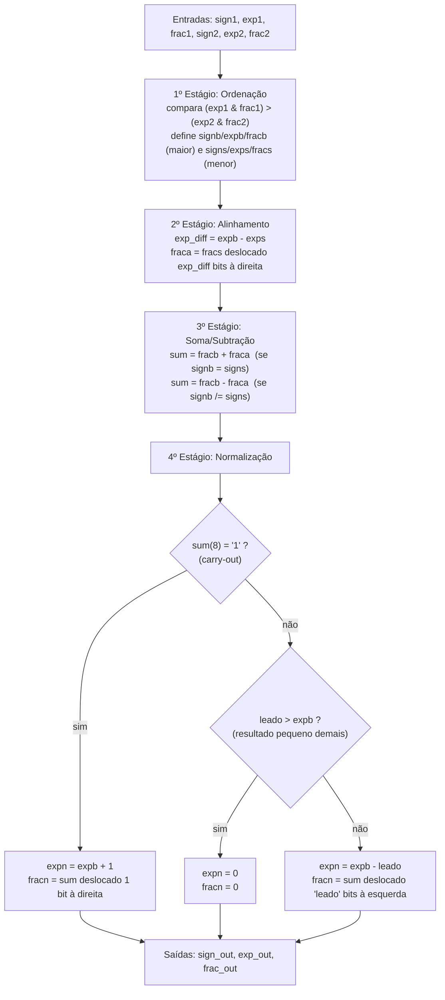

**template-somadorpf-vhdl**

# Tutorial: Implementação de Somador Ponto Flutuante na DE10-Lite

**Autores:** Bruna Montoro Teixeira, João Victor Chinarelli Cerqueira, Lívia de Pádua Ferné

**Disciplina:** Sistemas Digitais Q2.2026

**Data:** [Data da entrega]

---
*Etapa 1*
## 1. Objetivo do Projeto
Este projeto adapta o somador de ponto flutuante simplificado (13 bits) do livro-texto para a placa Terasic DE10-Lite (MAX 10). O objetivo é demonstrar a síntese lógica e a simulação de hardware usando VHDL.

Nesta primeira etapa, o objetivo é validar o algoritmo matemático do circuito original antes de qualquer adaptação de hardware, sendo assim, compilar o código exatamente como descrito no livro, simular com o GHDL e conferir, no GTKWave, se o 4º estágio (normalização) executa corretamente a contagem de zeros à esquerda e o deslocamento do significando nos três cenários possíveis (sem deslocamento, com deslocamento à esquerda e com carry-out).

## 2. Descrição gráfica do funcionamento do sistema
O `fp_adder` representa números em ponto flutuante simplificado de 13 bits: 1 bit de sinal, 4 bits de expoente (sem sinal) e 8 bits de significando normalizado (`0.f`). O valor representado é:

```
valor = (-1)^sign × 0.frac × 2^exp
```

**Entradas e saídas do VHDL:**

| Sinal | Direção | Largura | Descrição |
|---|---|---|---|
| `sign1`, `sign2` | entrada | 1 bit | sinal dos operandos A e B |
| `exp1`, `exp2` | entrada | 4 bits | expoente dos operandos A e B |
| `frac1`, `frac2` | entrada | 8 bits | significando dos operandos A e B |
| `sign_out` | saída | 1 bit | sinal do resultado |
| `exp_out` | saída | 4 bits | expoente do resultado |
| `frac_out` | saída | 8 bits | significando do resultado |

O circuito é combinacional e processa a soma em 4 estágios sequenciais:



`leado` conta quantos zeros à esquerda existem no resultado da soma/subtração (funciona como um codificador de prioridade sobre os bits de `sum`), e é usado tanto para decidir se o resultado deve virar zero quanto para definir quantas posições o significando deve ser deslocado à esquerda na normalização.

**Evidências de Validação**
Para validar o circuito original, foram criados 4 casos de teste no `tb_fp_adder.vhd`, cobrindo os três comportamentos possíveis do 4º estágio (normalização):

| Teste | A | B | Resultado esperado | O que valida |
|---|---|---|---|---|
| 1 | 192 (0.75×2⁸) | 192 (0.75×2⁸) | 384 → `exp=9, frac=C0` | soma com *carry-out* (deslocamento à direita, expoente +1) |
| 2 | 192 (0.75×2⁸) | −176 (−0.6875×2⁸) | 16 → `exp=5, frac=80` | subtração com zeros à esquerda (deslocamento à esquerda) |
| 3 | 160 (0.625×2⁸) | 72 (0.5625×2⁷) | 232 → `exp=8, frac=E8` | soma sem necessidade de deslocamento (`leado="000"`) |
| 4 | 6 (0.75×2³) | −6 (−0.75×2³) | 0 → `exp=0, frac=00` | cancelamento total (resultado convertido para zero) |

Abaixo, a imagem do funcionamento do 4º estágio (normalização) no GTKWave, considerando os 4 casos detalhados:


**Observando o resultado:** os quatro casos bateram exatamente com o cálculo manual (`exp_out` = 9 → 5 → 8 → 0 e `frac_out` = C0 → 80 → E8 → 00, respectivamente).

**Observação técnica sobre o "zero negativo":** no Teste 4, embora o resultado numérico seja zero, o `sign_out` obtido foi `'1'` (negativo) em vez de `'0'`. Isso acontece porque, no 1º estágio, quando `exp1 & frac1 = exp2 & frac2` (empate exato de magnitude), o algoritmo original sempre roteia o operando B como "big" (`signb <= sign2`), e a saída `sign_out <= signb` herda esse sinal — mesmo quando o resultado final é zero. Trata-se de uma característica do algoritmo original do livro, não de um erro de implementação. (Complementar melhor!!!)

Conclusão: **sim, o circuito realiza corretamente tanto a contagem de zeros à esquerda quanto o deslocamento de normalização**, nos três cenários descritos no livro-texto (sem deslocamento, com deslocamento à esquerda por subtração, e com deslocamento à direita por carry-out), além do caso de cancelamento total.

*Etapa 2*
## 3. Adaptações de Hardware (DE10-Lite)
Indicar o que a arquitetura original usava e quais mudanças foram feitas para a implementação na placa

**O que mudamos no VHDL original:**
* Removemos...
* Roteamos ...
* Reorganizamos ...

**Descrição gráfica do sistema**
* Caso mudar a descrição gráfica feita no item 2, atualizar aqui.
* Usar as variáveis de entrada e saída especificadas no VHDL.

## 4. Evidências de Validação

### Simulação 
Abaixo, a imagem do funcionamento do 4º estágio (normalização). Considerar os 4 casos detalhados.


### Código VHDL Final 
```vhdl
-- Insira aqui o VHDL final e faça ênfase nos trechos de código mais importantes da sua adaptação, isto é, eles devem estar claramente identificados.
```
*Etapa 3*

### Funcionamento na Placa
Abaixo, imagens do funcionamento na Placa para 4 casos.

*Etapa 4 (considerando qeu a Etapa 4 considera toda a documentação em si)*
## 5. Diário de Bordo de IA 
Utilizamos o Claude (Anthropic) para auxiliar na geração do testbench, na verificação dos resultados de simulação e na estruturação deste relatório. Abaixo está a análise crítica do uso da ferramenta.

**Prompts Utilizados:**
> "Insira aqui o prompt exato que você usou..."

**O Erro da IA (Alucinação):**
> Descreva aqui o que a IA errou (ex: tentou usar pinos inexistentes, criou clock em testbench de circuito combinacional, etc).

**A Correção Humana:**
> Como você corrigiu o código gerado para que ele funcionasse na nossa placa e na simulação.

## 6. Contribuição dos participantes
Utilize a taxonomia CRediT, seguem exemplos:
 * [Nome do Aluno 1], Administração do Projeto, Desenvolvimento, implementação e teste de software, Análise Formal
 * [Nome do Aluno 2], Validação de dados e experimentos
 * [Nome do Aluno 3], Redação do manuscrito original, Validação de dados e experimentos